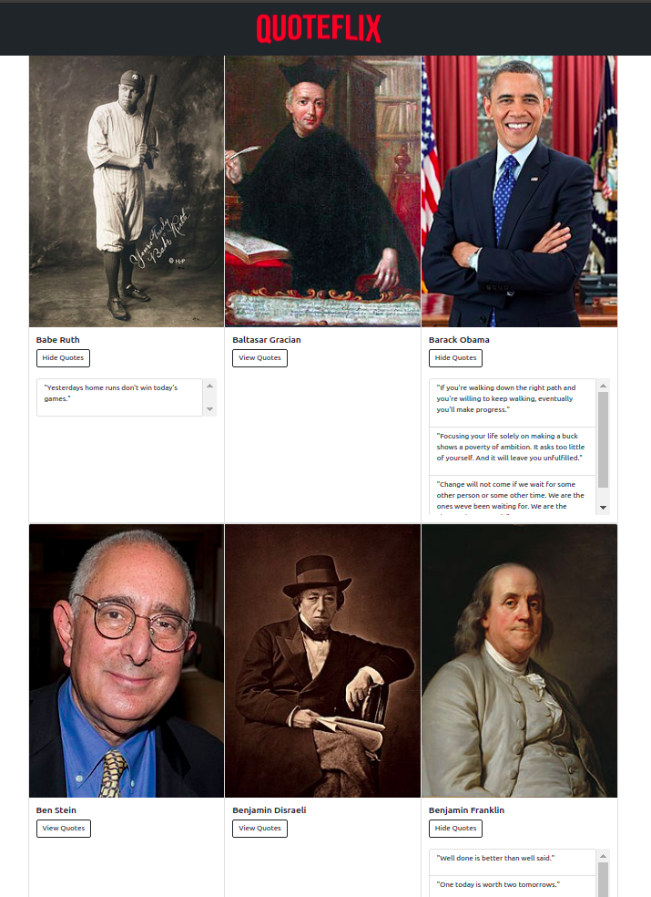
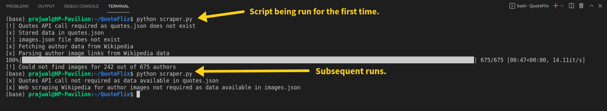
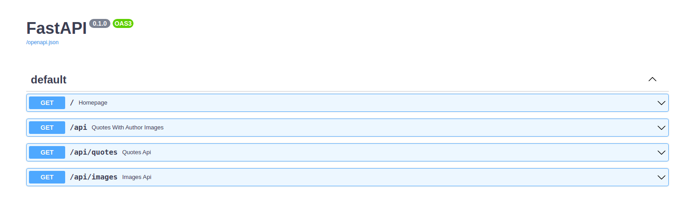

  

# Tech stack

  

# What it does?

- Get quotes from this [API](https://type.fit/api/quotes) using requests module.
- Fetch quote author image from wikipedia, if available.
- [grequests](https://github.com/spyoungtech/grequests) is used to fetch images asynchronously and [BeautifulSoup](https://www.crummy.com/software/BeautifulSoup/bs4/doc/) is used to parse the image links.
- A simple backend API is created using FastAPI. The following endpoints are available:
  - [Homepage](https://quoteflix.deta.dev/)
  - [Quotes With Author Images](https://quoteflix.deta.dev/api)
  - [Quotes](https://quoteflix.deta.dev/api/quotes)
  - [Author images](https://quoteflix.deta.dev/api/images)
- A simple frontend to serve the quotes along with the author image is created using Vue and styled using Bootstrap.
- The app is deployed on deta.sh.

# Screenshots

## Homepage

## Terminal

- The first time the script is run, the quotes are extacted from the quotes api and author image is fetched from wikipedia.
- The fetched quotes and images data is cached as a JSON file
- For subsequent runs of the script, the data is served from the JSON file.

## Docs

## References

- [Full Stack Python/Vue.js Web App Tutorial - Flask, Web Scraping & More](https://www.youtube.com/watch?v=zmylAaDsdiw)
